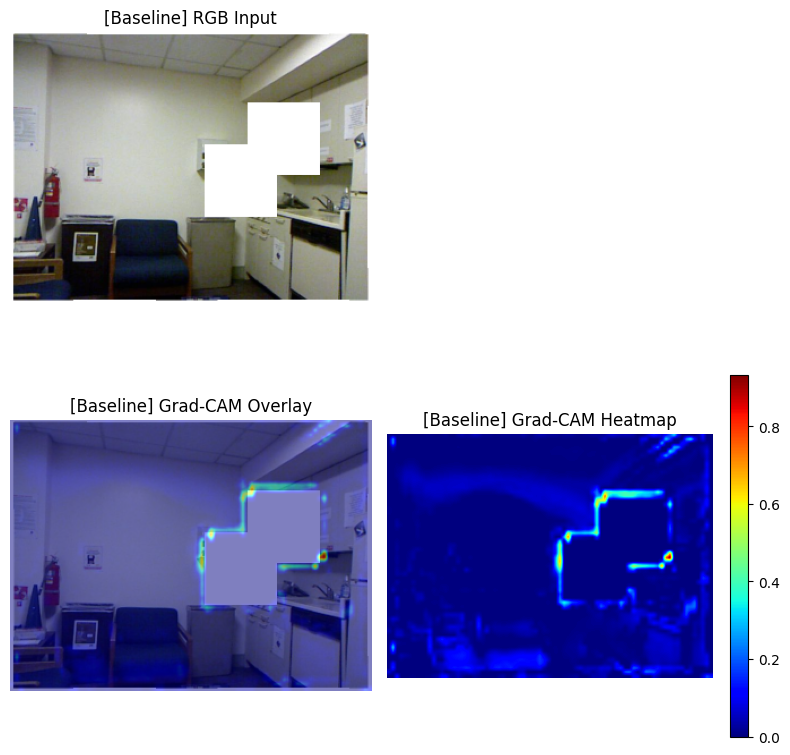

# Leveraging Depth and Attention Mechanisms for Improved RGB Image Inpainting

**Authors:**  
Jin Hyun Park, Dept. of Computer Science and Engineering, jinhyun.park@tamu.edu \
Harine Choi, Dept. of Multidisciplinary Engineering, harinec@tamu.edu \
Praewa Pitiphat, Dept. of Computer Science and Engineering, riolu_san@tamu.edu \
Texas A&M University, College Station, TX, 77840

## Summary

This paper introduces novel deep learning models for image inpainting that leverage both RGB and depth information, fused via attention mechanisms, to reconstruct missing regions in images. Traditional inpainting models often rely solely on RGB images and convolutional neural networks, which can lead to artifacts and poor reconstructions, especially for complex structures or large missing areas. Inspired by how human vision uses stereo cues for depth perception, our approach integrates a dual-encoder architecture, one encoder for RGB and the other for depth map, and fuses their features in the decoder using either simple (single-head) or multi-head attention. 

**Key Contributions:**

- **Dual-encoder architecture**: Processes RGB and depth images separately, then fuses features to enhance spatial and structural understanding.
- **Attention-based fusion**: Both simple (single-head) and multi-head attention mechanisms are explored to combine RGB and depth features, improving the model’s ability to focus on relevant regions.
- **Robust evaluation**: Models are tested under two challenging masking strategies (random lines and squares) to simulate different types of occlusions.
- **Interpretability**: Grad-CAM visualizations are used to analyze which image regions the models focus on during inpainting.

## Results at a Glance

| Method      | Mask Type | SSD (↓)   | PSNR (↑)  | SSIM (↑)  | LPIPS (↓) |
|-------------|-----------|-----------|-----------|-----------|-----------|
| Baseline    | Line      | 0.09328   | 1.56335   | 1.00644   | 0.41452   |
| DE-SHA      | Line      | 0.02182  (-76.61%)   | 1.92365 (+23.05%)   | 1.08205 (+7.51%)    | 0.08806 (-78.76%) |
| DE-MHA      | Line      | 0.01954  (-79.05%)   | 1.95208 (+24.87%)   | 1.09297 (+8.60%)    | 0.06690 (-83.86%) |

| Method      | Mask Type | SSD (↓)   | PSNR (↑)  | SSIM (↑)  | LPIPS (↓) |
|-------------|-----------|-----------|-----------|-----------|-----------|
| Baseline    | Square    | 0.07968   | 1.81590   | 0.99252   | 0.75372   |
| DE-SHA      | Square    | 0.07056 (-11.45%)  | 1.86784 (+2.86%)  | 1.02375 (+3.15%)  | 0.53271 (-29.32%) |
| DE-MHA      | Square    | 0.06813 (-14.50%)  | 1.89098 (+4.13%)  | 1.02495 (+3.27%)  | 0.52979 (-29.71%) |

- **Baseline (input: RGB, output: RGB)**: U-Net-like Encoder-Decoder model 
- **DE-SHA (input: RGB and Depth, output: RGB)**: Depth-Enhanced Simple (Single-Head) Attention model 
- **DE-MHA (input: RGB and Depth, output: RGB)**: Depth-Enhanced Multi-Head Attention model
- Lower SSD and LPIPS, higher PSNR and SSIM indicate better performance.
- Dataset: NYU Depth V2

**Highlights:**

- **Depth integration** reduces artifacts and improves reconstruction quality compared to RGB-only models.
- **Attention mechanisms** (especially multi-head) further enhance the ability to restore complex structures and textures.
- **Quantitative gains**: For line masks, DE-MHA reduces SSD by 79% and LPIPS by 84%, while increasing PSNR by 25% and SSIM by 9% over the baseline.
- **Qualitative improvements**: Depth-based models eliminate color artifacts and produce more realistic, coherent inpainted regions.

## Visual Results

- **Baseline (RGB-only):** Noticeable artifacts and color distortions in reconstructed areas.
- **Depth-Enhanced Models:** Cleaner, more accurate inpainting with fewer artifacts.  
- **Grad-CAM Analysis:** Attention-based models focus more on masked regions and structural boundaries than the baseline model.

| Figure 1. [Inpainting] Baseline with Line Mask | Figure 2. [Inpainting] DE-SHA with Line Mask |
|:--------------------------------:|:--------------------------------:|
|  |  |

| Figure 3. [Grad-CAM] Baseline with Square Mask | Figure 4. [Grad-CAM] DE-SHA with Square Mask |
|:--------------------------------:|:--------------------------------:|
|  |  |

## Takeaway

Integrating depth information and attention mechanisms into image inpainting models leads to significant improvements in reconstruction quality-both quantitatively and qualitatively. The dual-encoder, attention-fusion approach enables the model to better understand scene geometry and context, resulting in more robust and realistic inpainting.

## Citation
    @article{will_be_updated,
    title={Leveraging Depth and Attention Mechanisms for Improved RGB Image Inpainting},
    author={Jin Hyun Park, Harine Choi and Praewa Pitiphat},
    year={2025},
    institution={Texas A&M University}
    }
